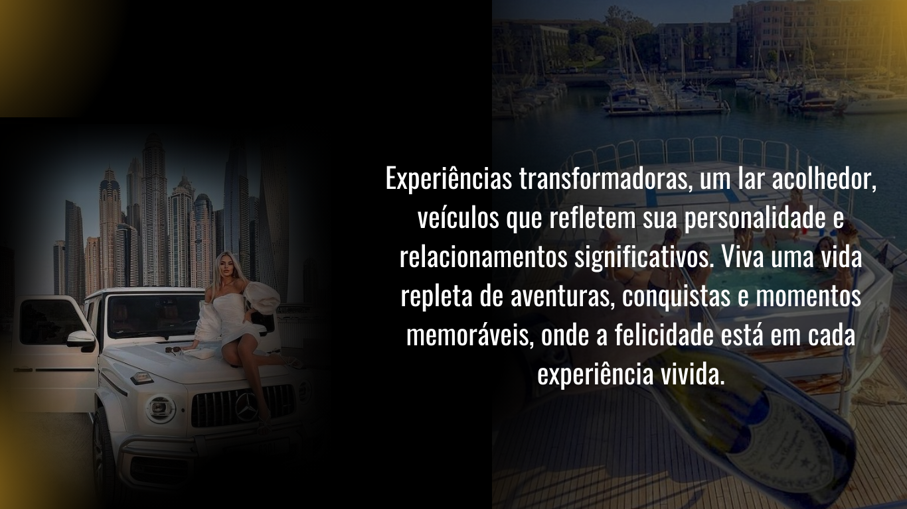

# Landing Page WordPress - Miniaturas de Perspectiva

Este design foi todo desenvolvido pelo próprio cliente, no canvas. https://minsdset.my.canva.site/
O mesmo pediu para reproduzi-lo em wordpress. https://ostop.digital/mindset/wordpress/

## Cabeçalho

## Conteúdo

## Rodapé

